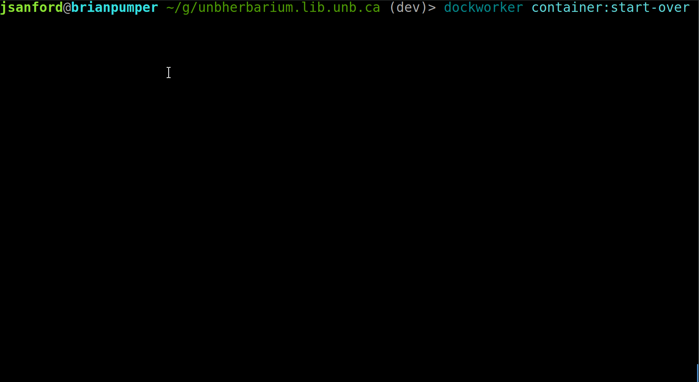

# Dockworker
## Local Instance Development for CargoDock Instances
Dockworker is a framework of (mostly) Robo commands that bridges local development of instances on Linux or OSX.

## Getting Started
### Requirements
The following packages are required to be globally installed on your development instance:

* [PHP7](https://php.org/) - Install instructions [are here for OSX](https://gist.github.com/JacobSanford/52ad35b83bcde5c113072d5591eb89bd).
* [Composer](https://getcomposer.org/)
* [docker](https://www.docker.com)/[docker-compose](https://docs.docker.com/compose/) - An installation HowTo for OSX and Linux [is located here, in section 2.](https://github.com/unb-libraries/docker-drupal/wiki/2.-Setting-Up-Prerequisites).

## License
- Dockworker is licensed under the MIT License:
  - http://opensource.org/licenses/mit-license.html
- Attribution is not required, but much appreciated:
  - `Dockworker by UNB Libraries`
